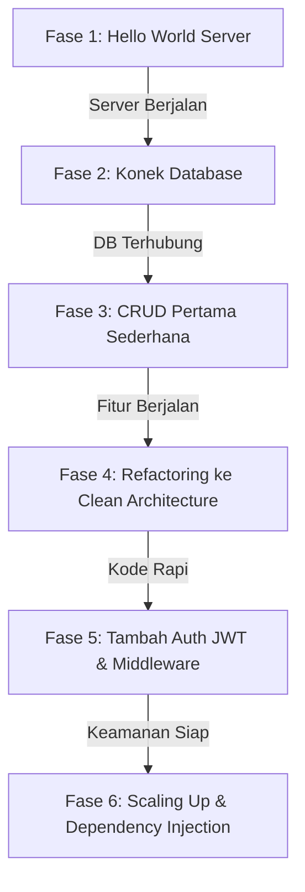

# 🌱 Panduan Evolusi Proyek Go (`go-roomify`) — Dari Sederhana Hingga Skala Besar

> **Filosofi Pengembangan:**  
> Seorang *developer* tidak langsung membuat 10 folder dan puluhan file di hari pertama. Manusia membangun aplikasi secara bertahap: **mulai dari yang paling sederhana (1 file `main.go`), memastikan fitur berjalan, lalu secara perlahan melakukan *refactoring* ke Clean Architecture saat proyek mulai membesar.**

---

## 🗺️ Roadmap Evolusi Pengembangan (Human Workflow)



---

## 📚 Indeks Dokumentasi Berdasarkan Fase Evolusi

| Fase | Topik Pengembangan | Apa yang Dikerjakan? | Link Dokumentasi |
| :---: | :--- | :--- | :--- |
| **01** | **Fase 1: Hello World Server** | Membuat HTTP server paling sederhana (1 file `main.go`) pakai Gin Gonic untuk memastikan server bisa `LISTEN & SERVE`. | [📄 Buka Fase 1](docs/01_fase_1_hello_world_server.md) |
| **02** | **Fase 2: Koneksi Database** | Menambahkan driver PostgreSQL (`lib/pq`) dan membuka koneksi DB sederhana di aplikasi. | [📄 Buka Fase 2](docs/02_fase_2_koneksi_database.md) |
| **03** | **Fase 3: CRUD Pertama (Monolit)** | Membuat 1 fitur CRUD utuh (misal: Ruangan) langsung dalam file sederhana untuk memahami alur `HTTP Request ➔ DB ➔ JSON Response`. | [📄 Buka Fase 3](docs/03_fase_3_crud_pertama_monolit.md) |
| **04** | **Fase 4: Refactoring Clean Arch** | Karena kode mulai menumpuk, kita pecah kode ke 4 layer utama: `model`, `repository`, `usecase`, dan `controller`. | [📄 Buka Fase 4](docs/04_fase_4_refactoring_clean_architecture.md) |
| **05** | **Fase 5: Otentikasi JWT & Guard** | Menambahkan sistem Login/Register, token JWT, dan proteksi endpoint dengan `middleware`. | [📄 Buka Fase 5](docs/05_fase_5_otentikasi_jwt_dan_middleware.md) |
| **06** | **Fase 6: Dependency Injection & Scale Up** | Merapikan wiring dependency di `delivery/server.go`, menggunakan Query Builder, Paginasi, dan menambah modul lain. | [📄 Buka Fase 6](docs/06_fase_6_dependency_injection_dan_scaleup.md) |

---

## 📂 Struktur Akhir Setelah Aplikasi Membesar

Setelah melalui Fase 1 hingga 6, proyek Anda secara alami akan bertransformasi dari 1 file tunggal menjadi struktur berkas profesional berikut:

```text
go-roomify/
├── GO_CLEAN_ARCHITECTURE_GUIDE.md   # Hub Utama Panduan Ini
├── docs/                            # Dokumentasi Evolusi Per-Fase
│   ├── 01_fase_1_hello_world_server.md
│   ├── 02_fase_2_koneksi_database.md
│   ├── 03_fase_3_crud_pertama_monolit.md
│   ├── 04_fase_4_refactoring_clean_architecture.md
│   ├── 05_fase_5_otentikasi_jwt_dan_middleware.md
│   └── 06_fase_6_dependency_injection_dan_scaleup.md
├── config/                          # Konfigurasi & DB Connection (Hasil Refaktor)
├── delivery/                        # Transport Layer / Controllers & Server Engine
├── middleware/                      # Auth JWT & Role Guard
├── model/                           # Domain Entities & DTOs
├── repository/                      # Data Access Layer (DB Queries)
├── usecase/                         # Business Logic Layer
├── utils/                           # Query Builder, JWT Helper, Paginate
├── .env                             # Environment Variables
├── go.mod                           # Modul & Dependensi Go
└── main.go                          # Entry Point Sederhana
```
