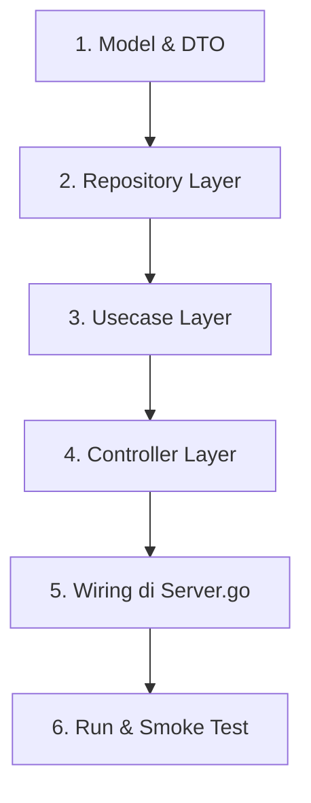

# 🔄 Bagian 10: Cheat Sheet & Alur Penambahan Fitur Baru

[⬅️ Kembali ke Panduan Utama](../GO_CLEAN_ARCHITECTURE_GUIDE.md) | [⬅️ Bagian 9](09_dependency_injection_dan_bootstrap.md)

---

## Urutan Pengembangan Fitur / Modul Baru

Ketika Anda ingin menambahkan modul baru ke dalam aplikasi (misalnya modul `Facility`), selalu ikuti 6 langkah sistematis berikut:



---

### Step 1: Model & DTO (`model/facility.go`)
Definisikan struct model data dan DTO request/response untuk modul baru.

```go
package model

type Facility struct {
	Id   string `json:"id"`
	Name string `json:"name"`
}
```

---

### Step 2: Repository Layer (`repository/facility_repository.go`)
Definisikan interface dan logika SQL (Insert, Select, Update, Delete).

```go
package repository

import (
	"database/sql"
	"go-roomify/model"
)

type FacilityRepository interface {
	Create(facility model.Facility) error
}

type facilityRepository struct {
	db *sql.DB
}

func NewFacilityRepository(db *sql.DB) FacilityRepository {
	return &facilityRepository{db: db}
}

func (r *facilityRepository) Create(facility model.Facility) error {
	_, err := r.db.Exec("INSERT INTO mst_facility (id, name) VALUES ($1, $2)", facility.Id, facility.Name)
	return err
}
```

---

### Step 3: Usecase Layer (`usecase/facility_usecase.go`)
Definisikan interface dan aturan bisnis/validasi.

```go
package usecase

import (
	"fmt"
	"go-roomify/model"
	"go-roomify/repository"
	"net/http"

	"github.com/google/uuid"
)

type FacilityUsecase interface {
	Create(payload model.Facility) (model.Facility, int, error)
}

type facilityUsecase struct {
	repo repository.FacilityRepository
}

func NewFacilityUsecase(repo repository.FacilityRepository) FacilityUsecase {
	return &facilityUsecase{repo: repo}
}

func (u *facilityUsecase) Create(payload model.Facility) (model.Facility, int, error) {
	if payload.Name == "" {
		return model.Facility{}, http.StatusBadRequest, fmt.Errorf("nama fasilitas wajib diisi")
	}
	payload.Id = uuid.New().String()
	err := u.repo.Create(payload)
	if err != nil {
		return model.Facility{}, http.StatusInternalServerError, err
	}
	return payload, http.StatusCreated, nil
}
```

---

### Step 4: Controller Layer (`delivery/controller/facility_controller.go`)
Definisikan routing HTTP dan handler-nya.

```go
package controller

import (
	"go-roomify/middleware"
	"go-roomify/model"
	"go-roomify/model/dto/response"
	"go-roomify/usecase"
	"net/http"

	"github.com/gin-gonic/gin"
)

type FacilityController struct {
	uc             usecase.FacilityUsecase
	rg             *gin.RouterGroup
	authMiddleware middleware.AuthMiddleware
}

func NewFacilityController(uc usecase.FacilityUsecase, rg *gin.RouterGroup, authMiddleware middleware.AuthMiddleware) *FacilityController {
	return &FacilityController{uc: uc, rg: rg, authMiddleware: authMiddleware}
}

func (c *FacilityController) Route() {
	router := c.rg.Group("/facilities")
	router.POST("", c.authMiddleware.RequireToken("ADMIN"), c.createHandler)
}

func (c *FacilityController) createHandler(ctx *gin.Context) {
	var payload model.Facility
	if err := ctx.ShouldBindJSON(&payload); err != nil {
		response.SendSingleResponseError(ctx, http.StatusBadRequest, "Invalid JSON")
		return
	}
	data, code, err := c.uc.Create(payload)
	if err != nil {
		response.SendSingleResponseError(ctx, code, err.Error())
		return
	}
	response.SendSingleResponse(ctx, code, "Fasilitas berhasil dibuat", data)
}
```

---

### Step 5: Wiring di `delivery/server.go`
Daftarkan repository, usecase, dan controller baru ke kontainer server:

```go
// Di dalam NewServer()
facilityRepo := repository.NewFacilityRepository(db.Conn())
facilityUc := usecase.NewFacilityUsecase(facilityRepo)

// Di dalam setupControllers()
controller.NewFacilityController(s.facilityUc, s.routerGroup, s.authMiddleware).Route()
```

---

### Step 6: Jalankan Server
```bash
go run main.go
```

---

[⬅️ Kembali ke Panduan Utama](../GO_CLEAN_ARCHITECTURE_GUIDE.md)
